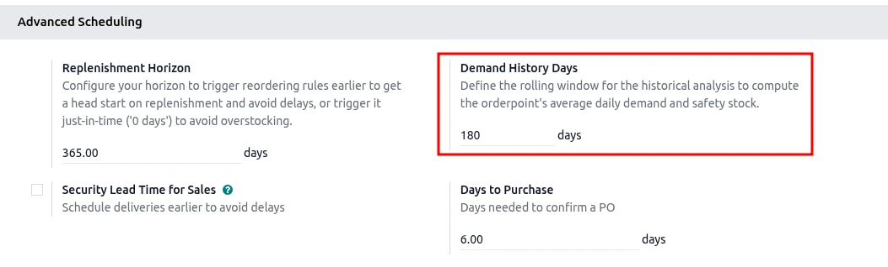
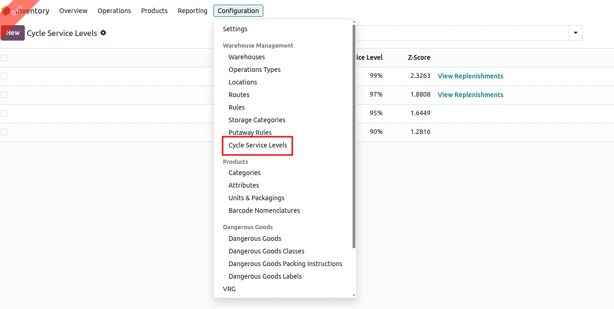

To efficiently use this module, some configuration must be done in Odoo.

## Demand History Days

In the **General Settings >Inventory**, under *Advanced Scheduling*, you have the possibility to set the **Demand History Days**.

It defines the rolling window for the historical analysis to compute the average daily demand and resulting safety stock. Defaults to `365`. Company-specific.

## Cycle Service Levels

They define the target probability of meeting all demand during a replenishment cycle without running out of stock.
The module comes with predefined values for Cycle Service Levels and their z-scores, but you can create more according to your needs.

