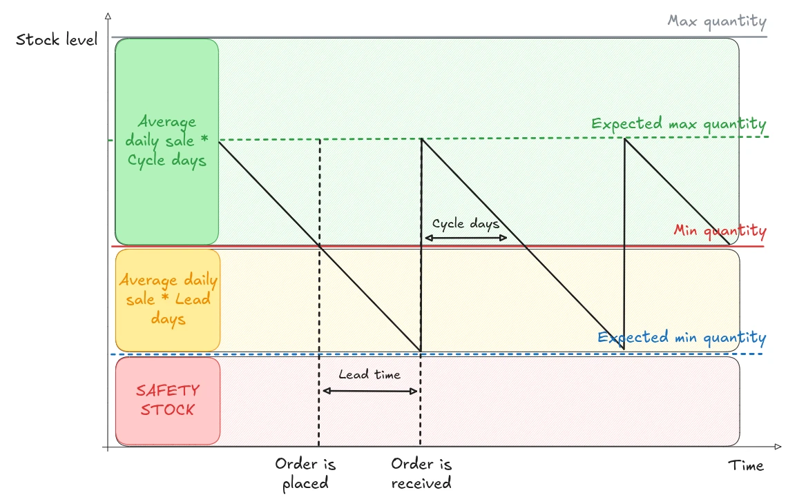

This module enhances inventory management by introducing service-level–based, stochastic control using a continuous review replenishment system. Instead of relying solely on fixed min/max stock levels, the module estimates your typical (mean) and variable (variance) daily demand from historical data and factors in lead time. These calculations generate a statistically sound safety stock, which is included in your reorder threshold (the “min”). The “max” is set so your inventory will cover expected demand during the entire replenishment cycle.

Now, you can set replenishment rules (orderpoints) based on the **Cycle Service Level (CSL)**, which reflects the probability of meeting all demand during a replenishment cycle without running out of stock. This provides a practical alternative to manually setting minimum and maximum stock thresholds.

With CSL enabled, safety stock is automatically calculated using your historical daily sales data (both average and standard deviation), gathered over a period you define, plus the orderpoint’s lead time. The system then keeps your reordering rule's min and max levels up-to-date.

Prefer manual control? You can always switch back to the “Manual” mode to specify min and max directly.

## Theory

The backbone of this approach is the Cycle Service Level (CSL), a widely used supply chain metric:

- **CSL Definition:** The chance that your inventory will fully cover demand during a restocking cycle.
- **Example:** A CSL of 95% means that only 5% of cycles will risk a stockout.

This system assumes demand is random (not fixed), so it uses statistical methods:

- **Average daily demand** (μ)
- **Standard deviation of daily demand** (σ)

Because demand can fluctuate during the lead time, safety stock acts as a buffer to reduce the risk of running out of stock.

**Safety stock formula:**

`safety_stock = σ_L × z × g`

Where:

- **σ_L:** Standard deviation of demand over the lead time
- **z:** Z-score for your desired CSL (e.g., 1.65 for 95% CSL)
- **g:** Growth factor (optional, lets you add a margin)

**Three zones are needed to define how min and max are derived:**

- **Red zone = safety stock:**
  - This zone should never be touched. It acts as the buffer for unexpected variation.
  - Refer to the safety stock formula above.
- **Yellow zone = expected demand during the lead time:**
  - This zone represents the expected stock consumption from the moment you click on replenish, until the moment you receive your purchase order.
  - Formula: `average daily demand × lead time in days`
- **Green zone = expected demand during the cycle:**
  - Represents the stock consumption during the desired reordering cycle (the time between two replenishments)
  - Formula: `average daily demand × cycle days`

Where:

- **lead time:** The time it takes to receive the order.
- **cycle days:** The desired number of days between orders.

From these three zones, the min and max quantities are derived as follows:
- **Minimum (min):** Red + Yellow
- **Maximum (max):** Red + Yellow + Green

**Why does it work?**

- Odoo triggers replenishment whenever stock falls below the min, which should be enough to cover variance (safety stock) and lead time demand.
- The max level is set high enough to cover all expected demand until the next restock, plus a buffer to cover the desired cycle days.

This makes inventory management both more data-driven and easier to maintain.

