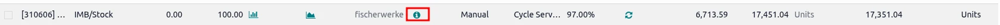
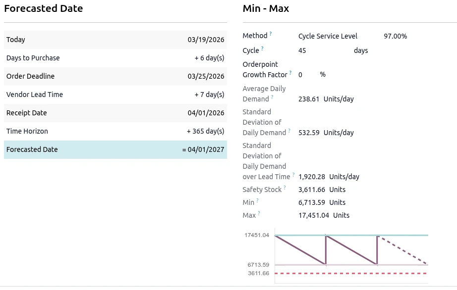
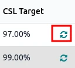
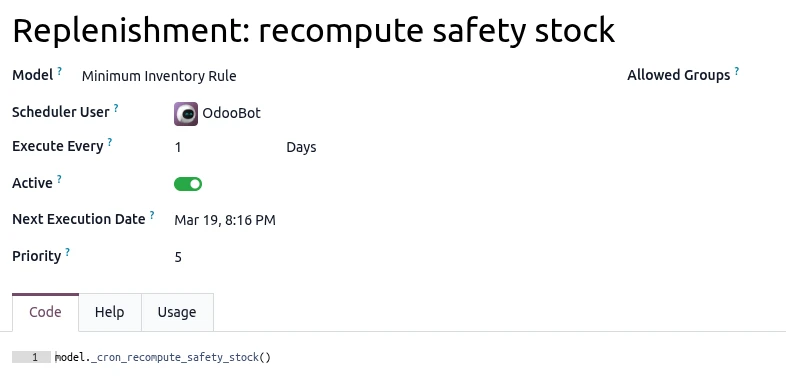
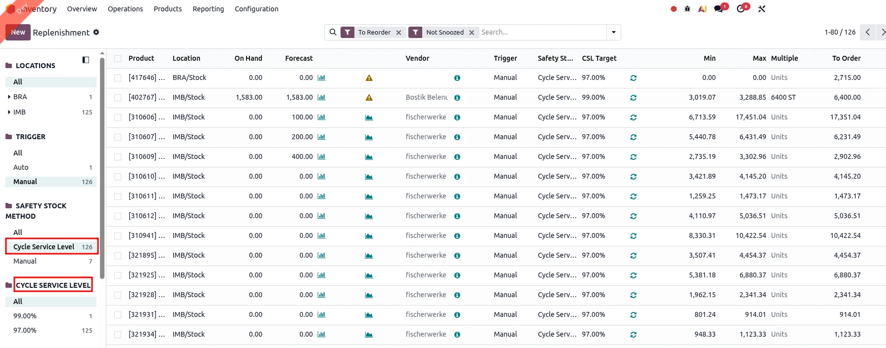

Set up your Replenishment Rules (Orderpoints) to use the **Cycle Service Level** method, and play with the following variables to fit your needs.
The module will recompute daily the **Min**, **Max** and thus the **To order** quantities based on the historical demand data and the parameters you set.

## Reordering Rule Parameters

**Safety Stock Method**

- **Manual**: The product's min and max quantities are set manually (standard Odoo behavior).
- **Cycle Service Level**: The product's min and max quantities are computed based on the target cycle service level, growth factor, order cycle and lead times.

**Cycle Service Level**

Defines the target probability of meeting all demand during a replenishment cycle without running out of stock. Typical values range from 90% to 99%.
A higher target increases safety stock to reduce the risk of stockouts; a lower target reduces inventory at the cost of more frequent shortages.

**Cycle Days**

The desired number of days between orders.
Used to size the gap between the min and max quantities, to cover the expected demand during the desired reordering cycle.

**Growth Factor**

An optional multiplier to account for expected growth in demand.
Will be applied to the safety stock and the resulting min and max quantities.

## Additional information

This module enhances the transparency of inventory management by displaying the full calculation path for minimum and maximum stock levels. By providing visibility into how safety stock formulas are derived directly within the user interface, it builds user trust and simplifies the verification of automated procurement rules.

When clicking on the ℹ️ icon, you are redirected to all the necessary info & configuration needed to use this OCA module:

**Note:** Some fields are only shown in "Developer Mode".

## Min & Max computation

All the statistics and safety stock are non-stored fields computed on-the-fly, while min & max quantities are computed either:

- Manually by clicking on the replenishment's 🔄 button

    

- Automatically by a daily scheduled action

    

## Usability filters

It's possible to filter on the safety stock method & on the cycle service level in the Orderpoint tree view:

